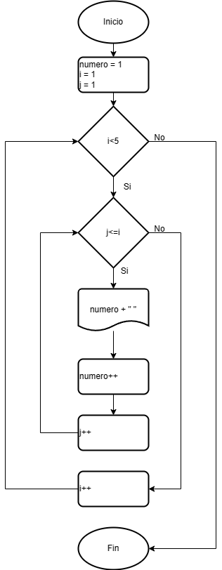
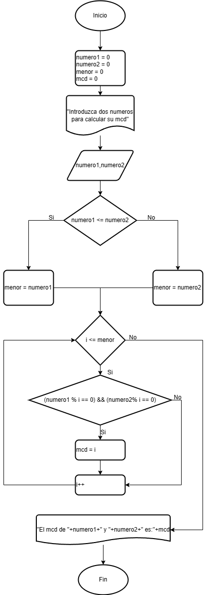
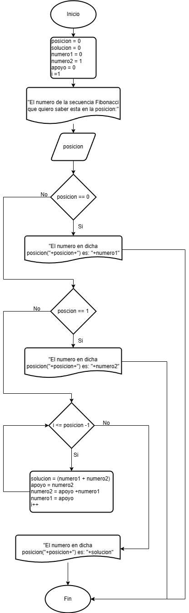
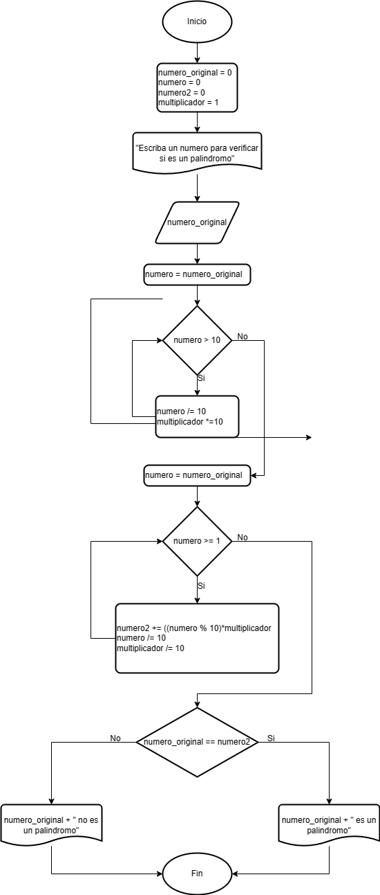
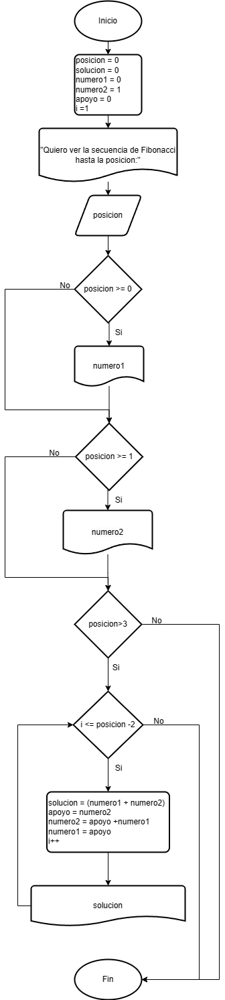
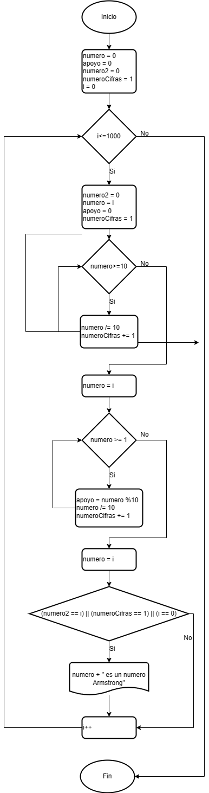
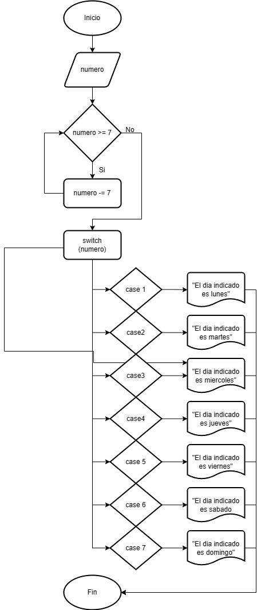
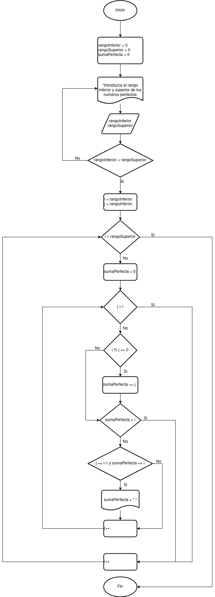
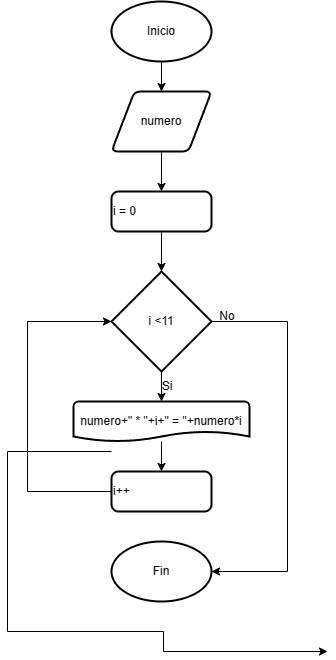
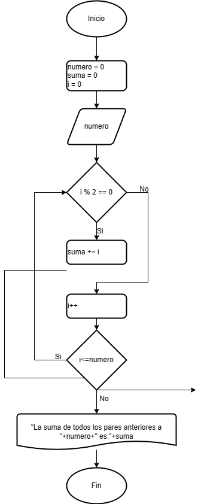

# Tarea 3

## Índice

- [Piramide de Numeros](#piramide)
- [Maximo Comun Divisor](#mcd)
- [Posicion en Fibonacci](#posicion)
- [Palindromo](#palindromo)
- [Secuencia Fibonacci](#secuencia)
- [Numeros Armstrong](#armstrong)
- [Dias de la semana](#dias)
- [Numeros perfectos](#perfectos)
- [Tabla de multiplicar](#tabla)
- [Suma de pares](#suma)

## Piramide de numeros 
Escribe un programa en Java que imprima el patrón siguiente:  
1  
2 3  
4 5 6  
7 8 9 10  

### Diagrama

### Pseudocódigo

1. Inicio
2. Inicializar las variables  
   **numero = 1**  
   **i == 1**  
   **j == 1**  
3. Mientras i<5  
   4. Mientras j<=i  
    -  Escribir numero + " "  
    -  **numero++**  
   -  **j++**  
4. **i++**
5. Fin

## Maximo comun divisor 
 Escribe un programa en Java que encuentre el máximo común divisor (MCD) de dos números.   
 Se debe solicitar los números por teclado.
### Diagrama de flujo

### Pseudocodigo
1. Inicializar las variables  
   **numero1 = 0**  
   **numero2 = 0**
   **menor = 0**
   **mcd = 0**
2. Escribir "Introduzca dos numeros para calcular su mcd"
3. Si numero1 <= numero2
  - **menor = numero1**
4. Sino
  - **menor = numero2**
5. Fin_Si
6. Mientras i <= menor  
7. Si numero1 % i == 0 && numero2 % i == 0
    - **mcd = i**
8. **i++**
9. Fin_Si
10. Escribir "El mcd de"+numero1+" y "+numero2+" es:"+mcd
11. Fin.

## Posicion en Fibonacci 
Escribe un programa en Java que encuentre el número de Fibonacci en la posición n.  
Se debe solicitar el número por teclado.

### Diagrama de Flujo

### Pseudocódigo

1. Inicio
2. Inicalizar las variables
   **posicion = 0**  
   **solucion = 0**  
   **numero1 = 0**  
   **numero2 =  1**  
   **apoyo = 0**  
   **i = 1**  
3. Escribir "El numero de la secuencia de Fibonacci que quiero saber esta en la posicion:"
4. Pedir el valor de **posicion** al usuario
5. Si posicion == 0
  - Escribir "El numero en dicha posicion ("+posicion+") es: "+numero1
6. Fin_Si
7. Si  posicion == 1
  - Escribir "El numero en dicha posicion ("+posicion+") es:"+numero2
8. Fin_Si
9. Sino
10. Mientras i <= posicion-1
  - **solucion = numero1+numero2**  
    **apoyo = numero2**  
    **numero2 = apoyo + numero1**  
    **numero1 = apoyo**  
    **i++**  
11. Fin_Mientras
12. Escribir "El numero en dicha posicion(+posicion+") es:"+solucion
13. Fin_Sino
14. Fin

## Palindromo 
Escribe un programa en Java que verifique si un número es palíndromo. Se debe solicitar el número por teclado.

### Diagrama de Flujo

### Pseudocódigo

1. Inicio
2. Inicializar las variables
   **numero_original = 0**  
   **numero = 0**  
   **numero2 = 0**  
   **multiplicador = 1**
3. Pedir al usuario el valor de **numero_original**
4. numero = numero_original
5. Mientras numero > 10
   - **numero /= 10**  
     **multiplicador** ***= 10**  
6. Fin_Mientras
7. numero = numero_original
8. Mientras numero >= 1
   - **numero2 += ((numero % 10)** * **multiplicador)**  
    **numero /= 10**  
    **multiplicador /= 10**
9. Fin_Mientras
10. Si numero_original == numero2
    - Escribir numero_original + " es un palindromo"
11. Fin_Si
12. Sino
    - Escribir numero_original + " no es un palindromo"
13. Fin_Sino
14. Fin

## Secuencia Fibonacci 
Escribe un programa en Java que imprima los primeros n términos de la secuencia de Fibonacci. 
Se debe solicitar el número n por teclado.

### Diagrama de Flujo

### Pseudocodigo

1. Inicio
2. Inicializar las variables
   **posicion = 0**
   **solucion = 0**
   **numero1 = 0**
   **numero2 = 1**
   **apoyo = 0**
   **i = 1**
3. Escribir "Quiero ver la secuencia de Fibonacci hasta la posicion:"
4. Pedir al usuario el valor de **posicion**
5. Si posicion >= 0 
   - Escribir numero1
6. Fin_Si
7. Si posicion >= 1
   - Escribir numero2
8. Fin_Si
9. Si posicion>=3
  10. Mientras i <= posicion -2  
- **solucion = numero1+numero2**  
      **apoyo = numero2**  
      **numero2 = apoyo + numero1**  
      **numero1 = apoyo**  
      **i++**  
- Escribir solucion
11. Fin_Mientras
12. Fin_Si
13. Fin

## Numeros Armstrong
Escribe un programa en Java que encuentre todos los números Armstrong entre 1 y 1000.
### Diagrama de Flujo

### Pseudocódigo

1. Inicio
2. Inicializar las variables  
   **numero = 0**  
   **apoyo = 0**  
   **numero2 = 0**  
   **numeroCifras = 1**  
   **i = 0**  
3. Mientras i<=1000
4. **numero2 = 0**  
   **numero = i**  
   **apoyo = 0**  
   **numeroCifras = 1**  
5. Mientras numero >= 10
6. **numero /= 10**  
   **numeroCifras +=1**
7. Fin_Mientras
8. **numero = i**  
9. Mientras numero>=1
10. **apoyo = numero % 10**  
    **numero2 += apoyo^numeroCifras**  
    **numero /= 10**  
11. Fin_Mientras
12. **numero = i**  
13. Si (numero2 == i) || (numeroCifras==1) || (i == 0)
14. Escribir numero+" es un numero Armstrong"
15. Fin_Si
16. Fin_Mientras
17. Fin

## Dias de la Semana 
Imprimir el nombre del día de la semana correspondiente a un número ingresado por el usuario utilizando una estructura switch.

### Diagrama de Flujo

### Pseudocódigo

1. Inicio
2. Pedir al usuario el valor de la variable **numero**
3. Mientras numero >= 7
4. **numero -=7**
5. Fin_Mientras
6. Switch (numero)
7. case 1
8. Escribir "El dia indicado es lunes"
9. case 2
10. Escribir "El dia indicado es martes"
11. case 3
12. Escribir "El dia indicado es miercoles"
13. case 4
14. Escribir "El dia indicado es jueves"
15. case 5
16. Escribir "El dia indicado es viernes"
17. case 6
18. Escribir "El dia indicado es sabado"
19. case 7
20. Escribir "El dia indicado es domingo"
21. Fin_Switch
22. Fin

## Numeros Perfectos 
Encontrar y mostrar todos los números perfectos en un rango dado utilizando un bucle for.   
Solicita el límite por teclado.

### Diagrama de flujo

### Pseudocódigo
1. Inicio
2. Inicializar las variables  
   **rangoInferior = 0**  
   **rangoSuperior =0**  
   **sumaPerfecta = 0**  
3. Mientras (rangoInferior < rangoSuperior)
   - Escribir "Introduzca el rango inferior de los números perfectos"
   - Pedir al usuario el valor para rangoInferior
   - Escribir "Introduzca el rango superior de los números perfectos"
4. Pedir al usuario el valor para rangoSuperior
5. Fin_Mientras
6. For (int i=rangoInferior ; i < rangoSuperior ; i++)
   - **sumaPerfecta = 0**
   - For (int j=rangoInferior ; j < i ; j++)
     - Si (i % j ==0)  
       - **sumaPerfecta += j**  
     - Fin_Si  
     - Si (sumaPerfecta > i)  
       - Break  
     - Fin_Si  
     - Si (j == i-1) y (sumaPerfecta == i)  
       - Escribir sumaPerfecta + " "  
     - Fin_Si  
   - Fin_For  
7. Fin_For  
8. Fin  

## Tabla de multiplicar 
Imprimir la tabla de multiplicar de un número ingresado por el usuario utilizando un bucle for.   
Solicita el valor de la tabla por teclado

### Diagrama de flujo

### Pseudocódigo

1. Inicio
2. Pedir al usuario el valor de la variable **numero**
3. Inicializar la variable **i = 0**
4. Mientras i<11
5. Escribir numero+" * "+i+" = "+numero*i
6. i++
7. Fin_Mientras
8. Fin

## Suma de Pares 
Calcular la suma de todos los números pares entre 1 y un número ingresado por el usuario utilizando un bucle do-while.

### Diagrama de Flujo

### Pseudocódigo

1. Inicio
2. Inicializar las variables  
   **numero = 0**
   **suma = 0**  
   **i = 0**
3. Pedir al usuario el valor para la variable **numero**
4. Mientras i<= numero
5. Si i % 2 == 0
6. suma += i
7. Fin_Si
8. i++
9. Fin_Mientras
10. Escribir "La suma de todos los pares anteriores a "+numero+" es:"+suma
11. Fin

